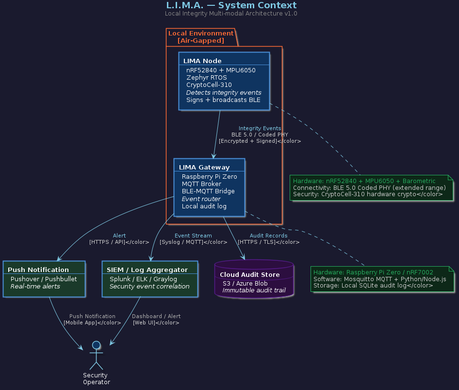
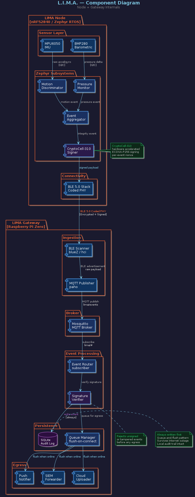

# L.I.M.A. — Local Integrity Multi-modal Architecture

> **A resilient, low-power Physical Intrusion Detection System (PIDS)**  
> Cryptographically signed integrity events from the edge to the operator.

[](https://github.com/jknoxdev/lima-node/actions)
[](LICENSE)
[](https://www.nordicsemi.com/Products/nRF52840)
[](https://developer.nordicsemi.com)

---

## What is LIMA?

LIMA nodes are small, battery-powered sensors that detect physical integrity events — door opens, enclosure breaches, vehicle towing, cabinet punctures — and deliver cryptographically signed alerts to a local gateway, which routes them to operators via push notification, SIEM, or cloud audit trail.

The system is designed to be **air-gapped first**. No cloud dependency for core operation. No persistent BLE connections. No trusted local network required. Just a node, a gateway, and a signed audit trail that survives internet outages.

**Two independent threat models, one pipeline:**

| Trigger | Use Case | Sensor |
|---|---|---|
| `PRESSURE_BREACH` | Cabinet puncture, enclosure door open, seal broken | BMP280 barometric |
| `MOTION_DETECTED` | Vehicle tow, rack movement, vibration attack | MPU6050 IMU |
| `DUAL_BREACH` | Full physical intrusion — moved AND breached | Both |

Each fires independently. An attacker must defeat both sensors simultaneously to avoid detection.

---

## Hardware

| Component | Part | Role |
|---|---|---|
| Edge Node | Nordic nRF52840 MDK USB Dongle | Sensor + crypto + BLE |
| IMU | MPU6050 | Motion / vibration detection |
| Barometric | BMP280 | Pressure delta detection |
| Crypto | CryptoCell-310 (on-die) | ECDSA-P256 hardware signing |
| Gateway | Raspberry Pi Zero | BLE scanner + MQTT broker |

---

## Architecture

### System Context


### Component Diagram


### Integrity Event Sequence


### Node Firmware State Machine


> All diagrams are maintained as PlantUML source in [`docs/architecture/`](docs/architecture/) and auto-rendered to SVG + PNG on every push via GitHub Actions.

---

## Security Design

- **Every event is signed & encrypted** — ECDSA-P256 via CryptoCell-310 hardware accelerator (~50ms, minimal power)
- **Per-event nonce** — prevents replay attacks
- **Tamper events are first-class** — a failed signature verification is itself logged and alerted
- **SQLite written first** — audit trail is intact regardless of internet connectivity
- **Queue-and-flush** — events survive gateway internet outages, delivered on reconnect
- **Air-gapped core** — no cloud dependency for detection, signing, or local audit

---

## Firmware Stack

```
┌──────────────────────────────────┐
│         Application Layer        │
│  Event Aggregator · State Machine│
├──────────────────────────────────┤
│         Zephyr RTOS              │
│  Scheduler · Power Mgmt · DTS    │
├──────────────────────────────────┤
│         Nordic NCS               │
│  BLE Stack · CryptoCell · HAL    │
├──────────────────────────────────┤
│         nRF52840 Hardware        │
│  Cortex-M4F · CryptoCell-310     │
└──────────────────────────────────┘
```

**NCS Version:** v3.2.0-rc1 · **Zephyr:** 4.3.99 · **Board:** `nrf52840_mdk_usb_dongle/nrf52840`

---

## Getting Started

See [`docs/FLASHING.md`](docs/build/FLASHING.md) for the complete build and flash guide.

```bash
# 1. Initialize workspace
python3 -m venv .venv && source .venv/bin/activate
pip install west
west init -l lima-node
west update

# 2. Install SDK requirements
pip install -r zephyr/scripts/requirements.txt
pip install -r nrf/scripts/requirements.txt

# 3. Build
west build -b nrf52840_mdk_usb_dongle/nrf52840 lima-node/firmware \
  -- -DCONFIG_BUILD_OUTPUT_UF2=y

# 4. Flash (dongle in bootloader mode)
west flash
```

---

## Repository Structure

```
lima-node/
├── firmware/               # nRF52840 Zephyr firmware
├── docs/
│   ├── FLASHING.md         # Build + flash guide
│   └── architecture/
│       ├── context.puml    # System context diagram
│       ├── component.puml  # Component diagram
│       ├── sequence.puml   # Event sequence diagram
│       ├── state.puml      # Firmware state machine
│       └── adr/
│           ├── ADR-001-nrf52840-selection.md
│           ├── ADR-002-ble-vs-alternatives.md
│           ├── ADR-003-mqtt-vs-alternatives.md
│           └── ADR-004-zephyr-vs-alternatives.md
├── artifacts/              # Scope captures, logic analyzer exports
├── west.yml                # NCS workspace manifest
└── README.md
```

---

## Architecture Decision Records

Major technical decisions are documented in [`docs/architecture/adr/`](docs/architecture/adr/):

| ADR | Decision | Status |
|---|---|---|
| [ADR-001](docs/architecture/adr/ADR-001-nrf52840-selection.md) | nRF52840 over ESP32 / STM32 | Active |
| [ADR-002](docs/architecture/adr/ADR-002-ble-vs-alternatives.md) | BLE 5.0 over Thread / Zigbee / LoRa | Active |
| [ADR-003](docs/architecture/adr/ADR-003-mqtt-vs-alternatives.md) | MQTT over CoAP / raw TCP / HTTP | Active |
| [ADR-004](docs/architecture/adr/ADR-004-zephyr-vs-alternatives.md) | Zephyr RTOS over bare metal / FreeRTOS | Active |
| [ADR-005](docs/architecture/adr/ADR-005-encrypt-everything.md) | AES-256-GCM + ECDSA-P256 on all payloads | Active |

---

## Roadmap

- [ ] Firmware: IMU + barometric sensor drivers (Zephyr I2C)
- [ ] Firmware: Event aggregator with independent OR trigger logic
- [ ] Firmware: CryptoCell-310 ECDSA-P256 signing & encryption
- [ ] Firmware: BLE advertisement with signed payload
- [ ] Gateway: BlueZ BLE scanner + paho MQTT publisher
- [ ] Gateway: Mosquitto broker + event router
- [ ] Gateway: SQLite audit log + queue-and-flush egress
- [ ] Gateway: Pushover / Pushbullet notification handler
- [ ] Hardware: KiCad schematic for production PCB
- [ ] Hardware: Power budget analysis + battery life model
- [ ] Docs: Threat model diagram
- [ ] Docs: Deployment guide

---

## License

Apache 2.0 — see [LICENSE](LICENSE)

---

*LIMA — because the null documentation era is over.*
