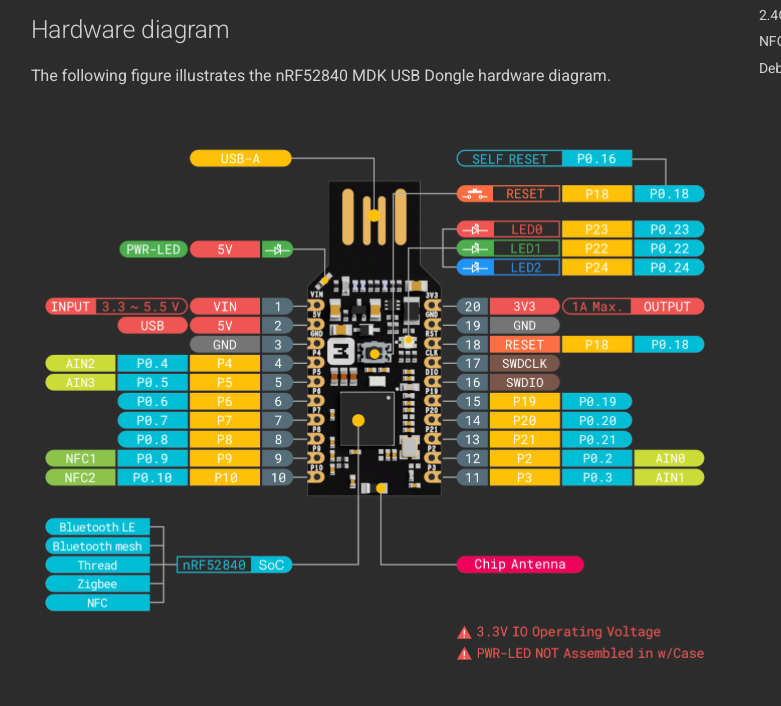
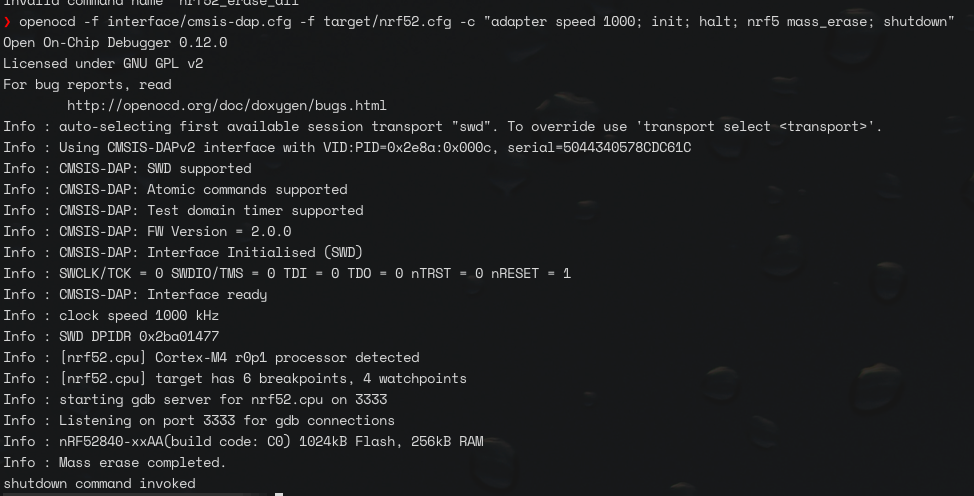
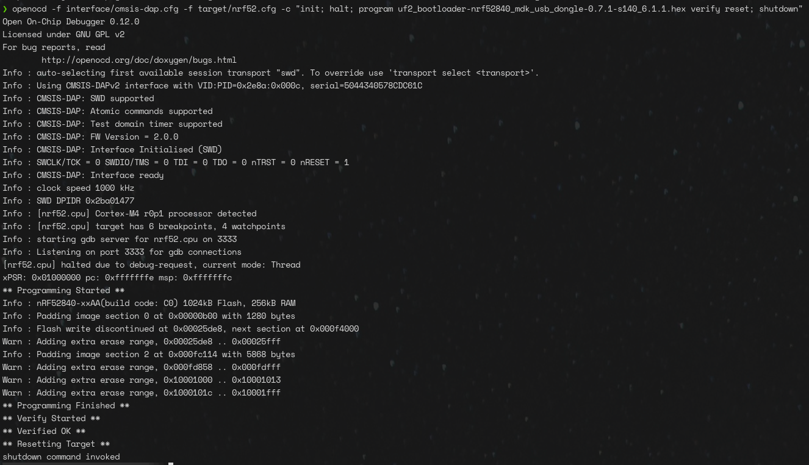
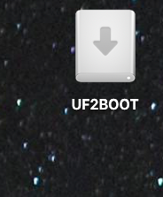

# 🚀 nRF52840 MDK USB Dongle: Bootloader Recovery Guide

This guide details the "bare-metal" recovery of a **MakerDiary nRF52840 MDK USB Dongle** (2019 Edition) using a **Waveshare RP2040-Zero** as the programmer. This process removes legacy factory locks and installs a modern UF2 bootloader.

---

## 🛠 Hardware Configuration

To bypass the "cannot read IDR" error, you must use the **dedicated SWD pins** located on the side of the dongle and the **Hardware Reset** pin to interrupt the active firmware.

### Wiring Mapping

| RP2040-Zero (Probe) | nRF52840 Dongle (Target) | Function |
| :--- | :--- | :--- |
| **3V3** | **Pin 1 (VIN)** | 3.3V Power |
| **GND** | **Pin 19 (GND)** | Common Ground |
| **GP2** | **Pin 17 (SWDCLK)** | Serial Wire Clock |
| **GP3** | **Pin 16 (SWDIO)** | Serial Wire Data |
| **GP4** | **Pin 18 (RESET)** | Hardware Reset |




---

## 💻 Software & Commands

### 1. Prerequisites
* **Probe Firmware:** RP2040-Zero must be running the **Picoprobe/Debugprobe** firmware (CMSIS-DAP mode).
* **OpenOCD:** Ensure OpenOCD is installed (`brew install open-ocd` on macOS).
* **Bootloader:** Download the official MakerDiary UF2 bootloader `.hex` file (e.g., `uf2_bootloader-nrf52840_mdk_usb_dongle-0.7.1-s140_6.1.1.hex`).

### 2. The "Galactic" Wipe (Mass Erase)
This command forces a connection via the Reset pin, identifies the chip, and wipes the legacy firmware along with the factory protection bits.

```bash
openocd -f interface/cmsis-dap.cfg -f target/nrf52.cfg -c "adapter speed 1000; init; halt; nrf5 mass_erase; shutdown"
```

Success Check: You should see SWD DPIDR 0x2ba01477 and Mass erase completed.


### 3. Flash the New Bootloader
With the chip erased, flash the new bootloader hex. This command automatically verifies the data integrity.

```bash
 openocd -f interface/cmsis-dap.cfg -f target/nrf52.cfg -c "init; halt; program uf2_bootloader-nrf52840_mdk_usb_dongle-0.7.1-s140_6.1.1.hex verify reset; shutdown"
 ```

Success Check: Look for ** Verified OK ** at the end of the output.


once the new firmware is installed, unplug the RP2040, and plug in the usb port of the NRF52480 and you should be greeted with the new volume loaded!



